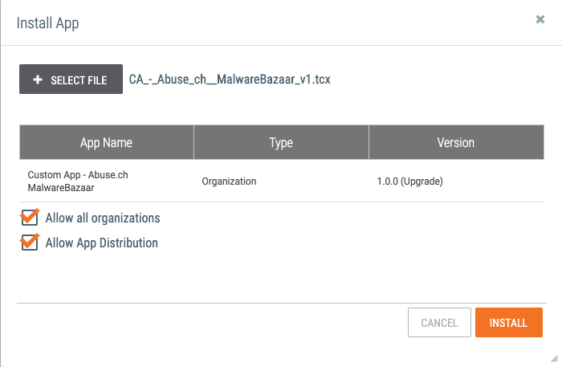
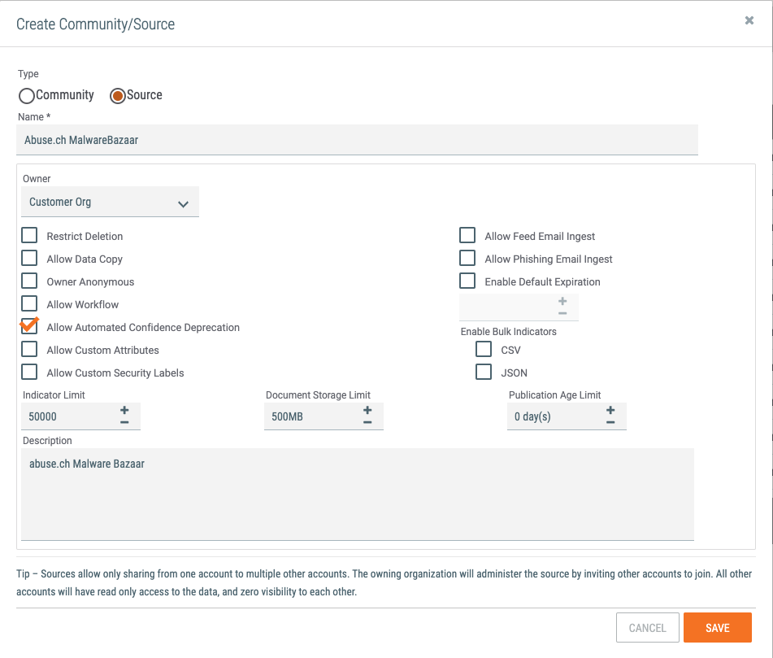
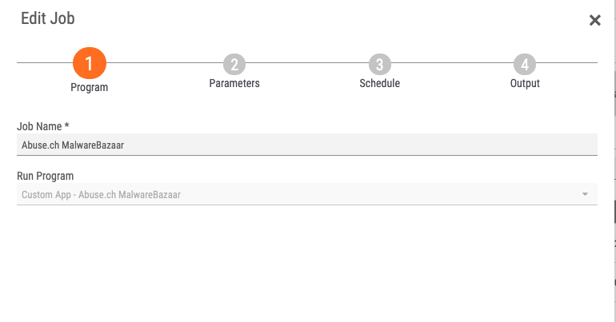
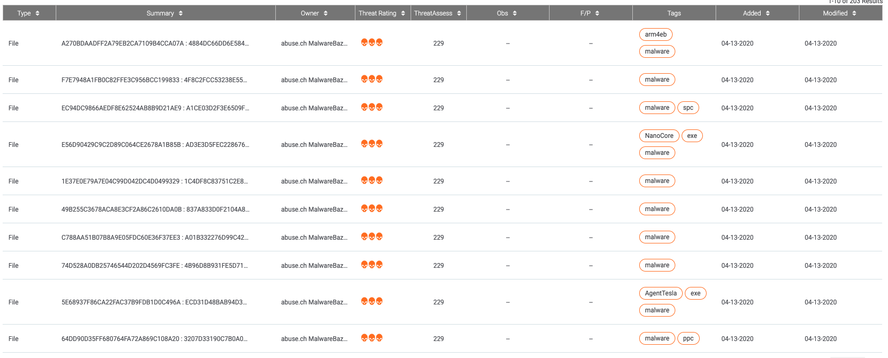
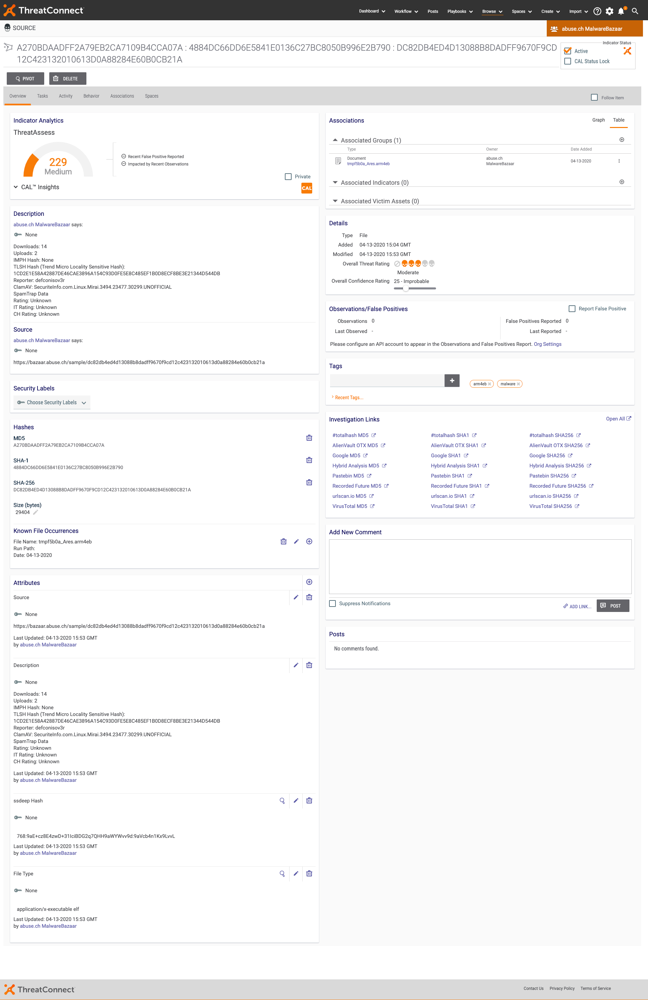
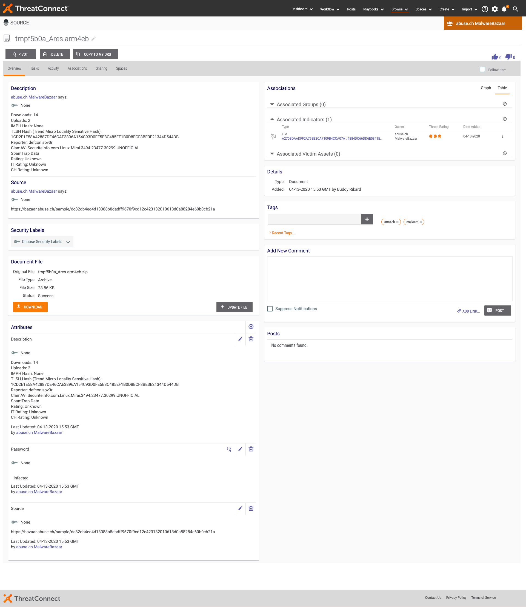

# NOTE: This is not a ThreatConnect supported app

# Getting Started

## Importing the app
As an Administrator, Import the .tcx file into TC Exchange via ⚙️ > TC Exchange Settings > Click the + to the far right and choose the downloaded tcx file.

 Ensure to select _CA_-_Abuse_ch__MalwareBazaar_v1.tcx_ and check the box for _allow all organizations_.

## Creating the source
By default you will not have an owner called *_abuse.ch MalwareBazaar_*. To create the source, as as Administrator goto:

⚙️ > Account Settings > Communities/Sources tab > +NEW.
- Check the box for _Source_
- For _Name_ enter _Abuse.ch MalwareBazaar_
- Select the Org which will own this source, in my example _Customer Org_
- Add some document storage as necessary. A good baseline to start is 500MB.
- Additionally check the box for Allow Automated Confidence Deprecation
- Lastly, provide a description such as, _abuse.ch Malware Bazaar_

## Creating the job
As an Org Administrator, [create the job](https://training.threatconnect.com/learn/article/creating-jobs-using-tc-exchange-apps-kb-article) by going to ⚙️ > Org Settings > Apps (tab) ensuring that for Run Program you select:
_Custom App - Abuse.ch MalwareBazaar_ and providing a recognizeable name for the job such as _Abuse.ch MalwareBazaar_.

### App Paramters
On the next screen you are presented with the below configurable options:

- Owner is the owner in which the indicators/groups will be created in.
- Rating is the default rating to apply to the ingested indicators.
- Confidence is the confidence to apply to the ingested indicators.
- Selector options controls the results returned from MalwareBazaar's API. The two valid options are (time) or (100). Time returns all submitted samples from within the past 60  minutes. 100 returns the most recent 100 samples submitted
- Download Malware Samples if enabled will download the samples from Abuse.ch's API, *if enabled an API Key is required!*
- API Key is the API key from [Abuse.ch MalwareBazaar](https://bazaar.abuse.ch/api/#api_key)
- Additional Tags this takes a pipe (|) delimited list of additional tag(s) to apply to the ingested indicators/groups.
- Demo Mode if enabled will set the selector to 100 results and truncate it down to only the first two results in the set.
- Logging level will control the level at which logs are produced with _info_ producing the least and _debug_ producing the most verbose logging possible.

### Job Scheduling

# Browse
After the app has ran, you will see results similar to the below.

Browse:

Indicator:

Group:
