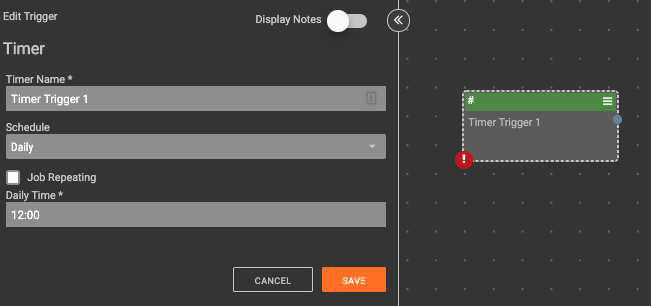
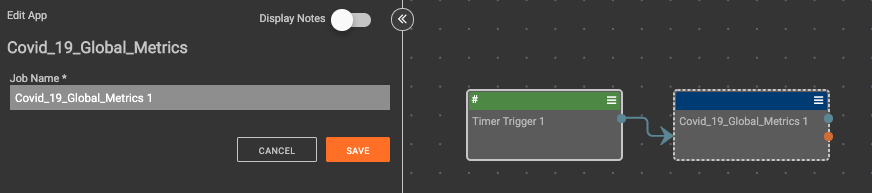
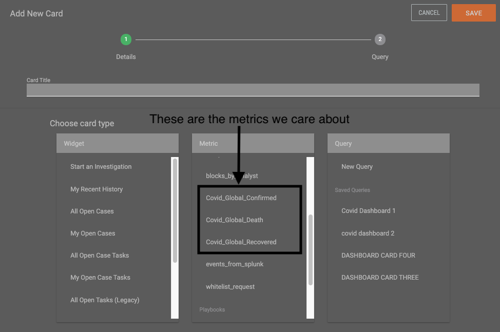
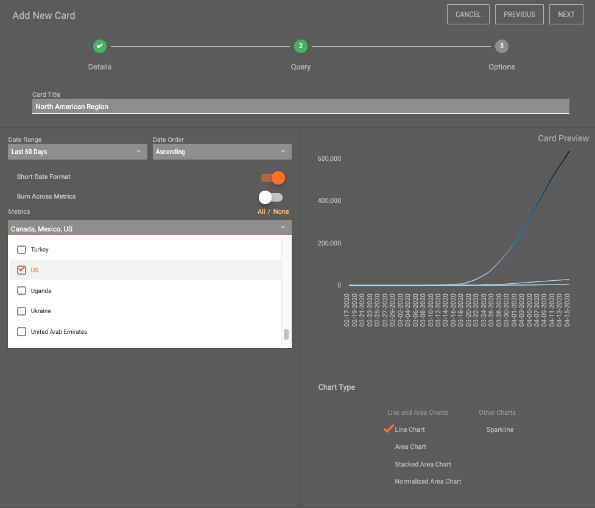
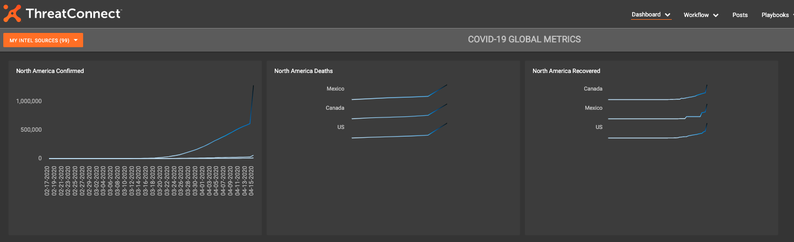

# NOTE: This is not a ThreatConnect supported app

# Getting Started

## Importing the app project
Download the provided .abx file into [AppBuilder](https://training.threatconnect.com/learn/article/app-builder-kb-article#2.3).

### Build the app
[Ensure the app builds without any errors](https://training.threatconnect.com/learn/article/app-builder-kb-article#3.11)

### Release the app
[Release the app onto AppCatalog](https://training.threatconnect.com/learn/article/app-builder-kb-article#3.13)

# Creating the playbook
Create a new Playbook and add a timer trigger

## Configuring the trigger
Set the timer trigger to run daily:

## Add the app
Add the app to the playbook and connect it the timer trigger.
 Ensuring to click the app _without_ the wrench icon.

# Configure the app
No configuration required!  The app is designed to create the metrics if they don't exist.  Save the app and Activate the Playbook.  This will take about an hour to run the first time.  There's A LOT of data that it's adding to the metrics.

# Dashboarding
## TQL

### Create a new dashboad
[Create a new dashboard to add your cards to](https://training.threatconnect.com/learn/article/dashboard-kb-article#2.1)

## Add cards
[Add a new Metric Card](https://training.threatconnect.com/learn/article/dashboard-kb-article#2.2.2) 

Choose any one of the three metrics to be taken to the configuration screen.

Selecting the dropdown you're presented with 185 countries with which to add to your cards.  The dashboard has a top limit of 36 Keyed Metrics (some geographical regions may have to be split into multiple cards)

That's it, there ya go!  (Ignore my last screenshot, I ran the playbook again and it duplicated the last days data.)