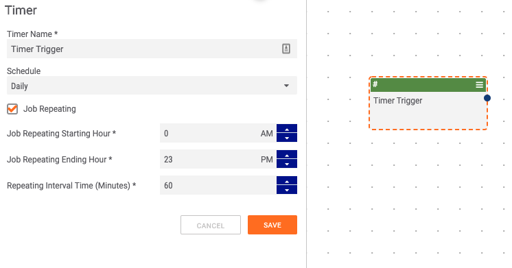
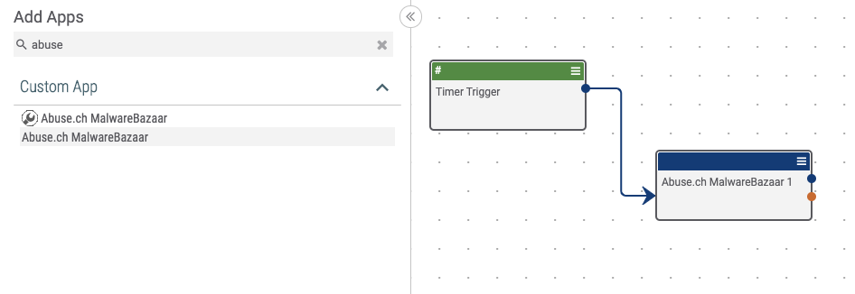
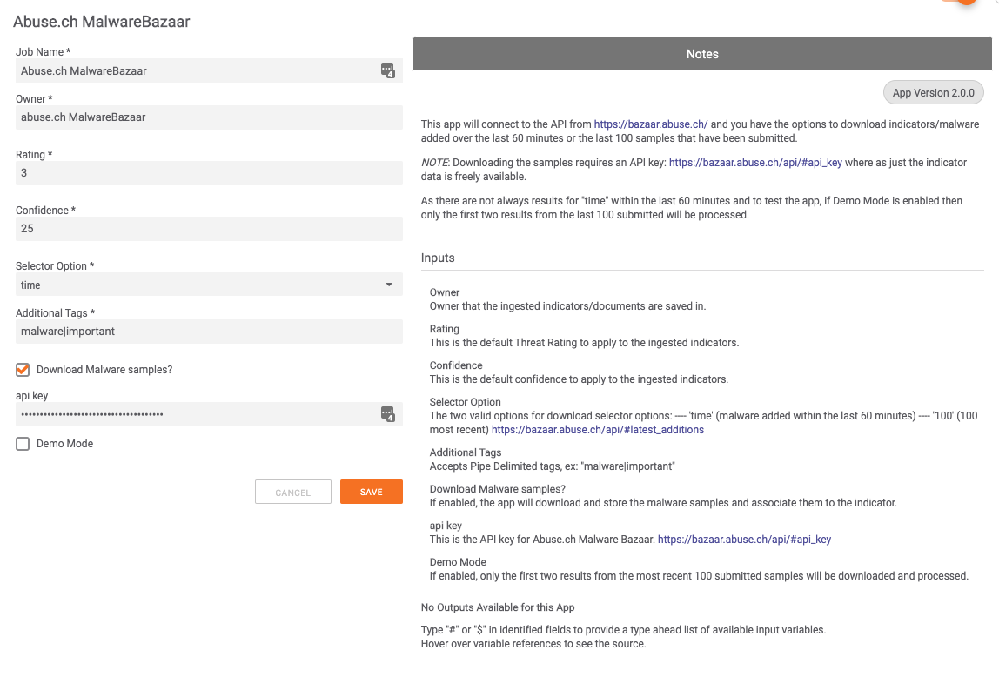

# NOTE: This is not a ThreatConnect supported app

# Getting Started

## Pre-requisite:

### Creating the source
By default you will not have an owner called *_abuse.ch MalwareBazaar_*. To create the source, as as Administrator goto:

⚙️ > Account Settings > Communities/Sources tab > +NEW.
- Check the box for _Source_
- For _Name_ enter _Abuse.ch MalwareBazaar_
- Select the Org which will own this source, in my example _Customer Org_
- Add some document storage as necessary. A good baseline to start is 500MB.
- Additionally check the box for Allow Automated Confidence Deprecation
- Lastly, provide a description such as, _abuse.ch Malware Bazaar_

# Importing the app project
Download the provided .abx file into [AppBuilder](https://training.threatconnect.com/learn/article/app-builder-kb-article#2.3).

### Build the app
[Ensure the app builds without any errors](https://training.threatconnect.com/learn/article/app-builder-kb-article#3.11)

### Release the app
[Release the app onto AppCatalog](https://training.threatconnect.com/learn/article/app-builder-kb-article#3.13)

# Creating the playbook
Create a new Playbook and add a timer trigger

## Configuring the trigger
Set the timer trigger to every 60 minutes by:
- setting the schedule to daily
- checking the _Job Repeating_ box
- Set starting hour to 0
- Set ending hour to 23
- Set repeating Interval Minutes to 60

## Add the app
Add the app to the playbook and connect it the timer trigger.
 Ensuring to click the app _without_ the wrench icon.

# Configure the app
Double click the _Abuse.ch MalwareBazaar_ app on the canvas.

- API Key is the API key from [Abuse.Ch MalwareBazaar](https://bazaar.abuse.ch/api/#api_key)
- Owner is the owner in which the indicators/groups will be created in (default is *_abuse.ch MalwareBazaar_* which you will need to create on your instance)
- Rating is the default rating to apply to the ingested indicators.
- Confidence is the confidence to apply to the ingested indicators.
- Selector options controls the results returned from MalwareBazaar's API. The two valid options are (time) or (100). Time returns all submitted samples from within the past 60  minutes. 100 returns the most recent 100 samples submitted
- Additional Tags this takes a pipe (|) delimited list of additional tag(s) to apply to the ingested indicators/groups.
- Download Malware Samples if enabled will download the samples from Abuse.ch's API, *if enabled an API Key is required!*
- Demo Mode if enabled will set the selector to 100 results and truncate it down to only the first two results in the set.

# Browse
After the app has ran, you will see results similar to the below.

Browse:

Indicator:

Group:
