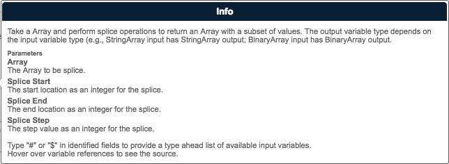
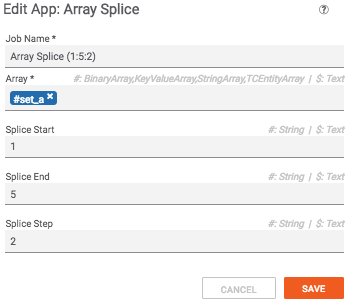
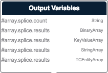

# Release Notes
## 1.0.0
* Initial Release

---

# Summary
This playbook App will splice the supplied Array using the start, end and step values provided. Only the appropriate output variable type will be supplied (e.g., StringArray input provides StringArray output).



# Dependencies
* tcex>=0.7,<0.8

# Input Definitions
* Array - The Array to splice.
* Splice Start - The starting index for the Splice (0 based index).
* Splice End - The ending index for the Splice.
* Splice Step - The step value for the Splice.



# Output Definitions
* array.splice.count (String)- The number of results in `array.results`.
* array.splice.results (BinaryArray) - The resulting values from the splice for BinaryArray input.
* array.splice.results (KeyValueArray) - The resulting values from the splice for KeyValueArray input.
* array.splice.results (StringArray) - The resulting values from the splice for StringArray input.
* array.splice.results (TCEntityArray) - The resulting values from the splice for TCEntityArray input.



# Building

```
pip install tcex
tclib
tcpackage
```

# Local Testing

All the environment variables in `tcex.d/profiles/array_set_operations.json` file must be set on the local system.

```
tcrun --group qa-build
```