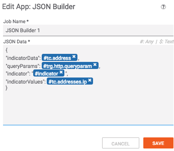
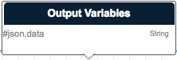

# Release Notes
## 1.0.0
* Initial Release

---

# Summary
This playbook App will take a JSON formatted String with embedded variables and output a JSON String.

> Note: String value must be wrapped in double quotes.  All other values should **not** have double quotes.


# Dependencies
* tcex>=0.7,<0.8

# Input Definitions
* JSON Data - The JSON string to resolve embedded variables.



# Output Definitions
* json.data - The JSON String with optional embedded variables resolved.



# Building

```
pip install tcex
tclib
tcpackage
```

# Local Testing

All the environment variables in `tcex.d/profiles/json_builder.json` file must be set on the local system.

```
tcrun --group qa-build
```