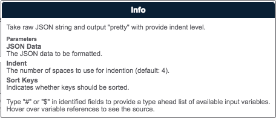
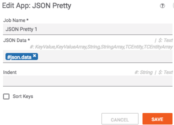
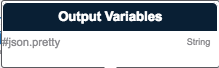

# Release Notes
## 1.0.0
* Initial Release

---

# Summary
This playbook App will take a JSON String and format it for pretty output.



# Dependencies
* tcex>=0.7,<0.8

# Input Definitions
* JSON Data - The JSON string to be formatted.
* Indent - The number of spaces to indent each section.
* Sort Keys - Whether or not to sort keys.



# Output Definitions
* json.pretty - The formatted JSON String.



# Building

```
pip install tcex
tclib
tcpackage
```

# Local Testing

All the environment variables in `tcex.d/profiles/pretty.json` file must be set on the local system.

```
tcrun --group qa-build
```