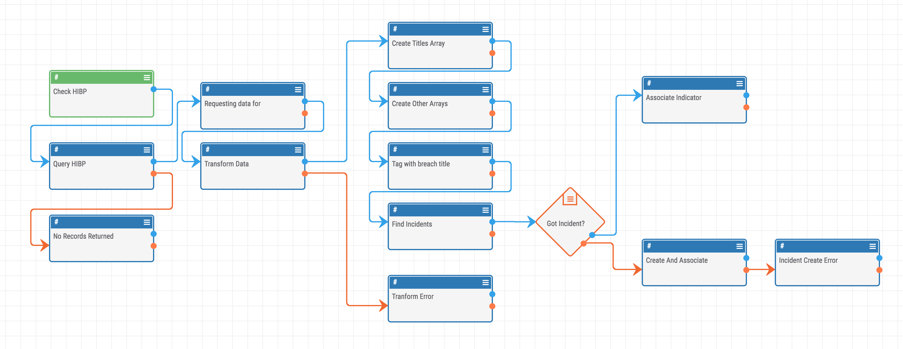
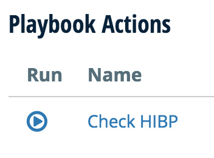
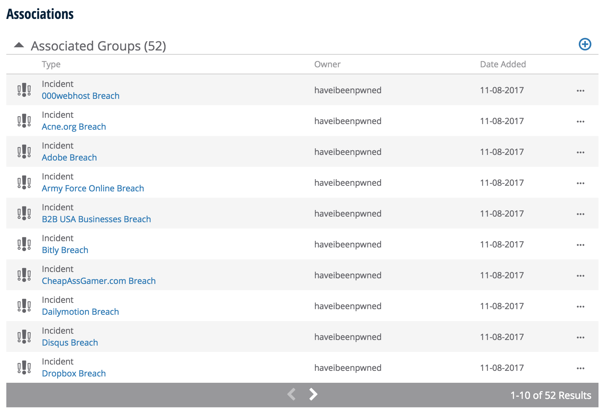
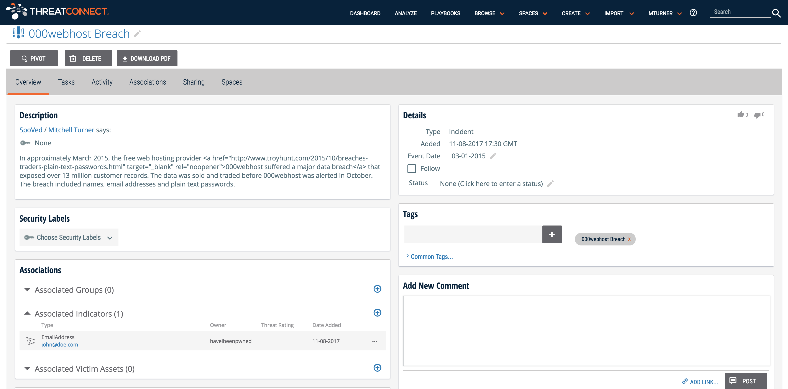

# Have I Been Pwned?

This is a demo PlayBook for ThreatConnect.  This will automate the process of querying HIBP for your EmailAddress Indicators.

To use this import [have-i-been-pwned.pbx](have-i-been-pwned.pbx) into your ThreatConnect instance and then enable the PlayBook.

Once that is done you will see a "Check HIBP" action on each of your EmailAddress indicators.

Just click the button and the work of collecting the data and creating an incident is doen for you by the ThreatConnect Platform.

Once it is complete you will see new tags added to the indicator for future filtering as well as an Incident assosciation.

## Tags

## Associated Incidents

## Individual Incident

[Full Incident PDF](000webhost-Breach-Incident.pdf)