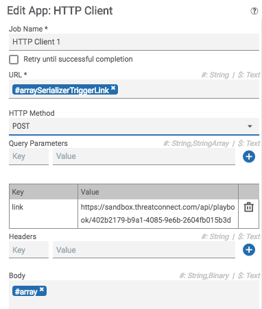

# Summary

Given an array, this playbook sends each item in the array one at a time to another playbook. This allows you to run a playbook on each item of an array.

# Dependencies

n/a

# Usage

This playbook expects an array to be sent (as a string) in the body of an http POST request to the trigger of this playbook. It also requires a `link` query parameter providing the playbook trigger link to which you would like to send each item in the array. Each item in the array will be send to the playbook trigger link in the body of a request. A request to this app will look something like:



To send data into this playbook, you must wrap the incoming data in square brackets ("[" and "]"). For example, let's say you have a string array. In order to send the data from this array into the array serializer, you would have to first pass the string array through the "Join Array" app to convert the array to a string. Next, in the "HTTP Client" app that calls the array serializer, the body should look something like:

```
[#joinedArray]
```

The joined array (which is a string), must be surrounded by square brackets.

# Use Cases

* Perform an action on each item in an array
